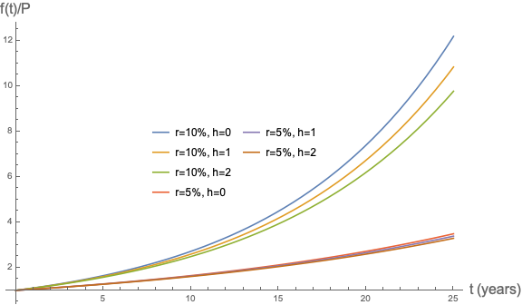



(02 Apr 2021) People who do not do math, physics, chemistry, etc. for a living very often ask me why my work never has any numbers. They ask what I'm doing, I say "math", they say "that doesn't look like math, I don't see any numbers..what are all those symbols?", and I say "why would I ever use numbers when I can just use a symbol?". In this post, I will attempt to better illistrate why one rarely need bother with numbers, and why symbols are part of what makes math so powerful, clear, and precise. I will show an incredibly simple problem where solving it requires essentially no numbers and results in a multitude of symbols popping up. Of course, the need for symbols only greater as the problems get significantly more challenging.

One quick caveat. Most of my posts on this site are intended for a math or physics audience. More accurately, I don't expect anyone to ever read them, so they are just meant for my benefit. I write down interesting things that I have learned so that I will remember them and can have a reference for them in the future. But this post will be geared toward an audience with little to no math background, or those who have not practiced it in a while. After all, it is their question that I am attempting to answer.

### Compounding interest

Suppose that you put your money in a bank account that offers an annual interest rate of $$r$$. Already we encounter a letter instead of a number. Ultimately, we want to be able to compare how the money grows in the account and how it depends on the interest rate. So we don't want to commit to a number yet, and will instead just call it $$r$$. For example, a 1% annual interest rate would correspond to $$r = 1/100$$.

Suppose that the interest is compounded every $$h$$ years. For example, if the interest is compounded annually, then $$h=1$$. If the interest is compounded monthly, then $$h=1/12$$ (i.e. every one-twelth of a year). If the interest is compounded daily, then $$h=1/365$$.

Finally, suppose that we have a function $$f(t)$$ that tells use how much money is in the account after $$t$$ years. For example, $$f(0)$$ is how much money you put into the account, $$f(1/2)$$ is how much money is in the account after six months, and $$f(2)$$ is how much money is in the account after two years. Again, we have introduced another symbol; this time, though, it is encoding a lot more than just a number like $$r$$ and $$h$$ are encoding. $$f(t)$$ is a function, meaning that you can plug in any value of $$t\geq 0$$ (i.e. nonnegative $$t$$), and it will tell you how much money is the account after that many years.

Suppose that you have 10 dollars in your account. When the interest is compounded, the bank will add $$10 \times h\times r$$ dollars to your account (this is precisely the definition of an interest rate $$r$$ coumpounded every $$h$$ years). So in total you will have $$10 + 10 \times h\times r = 10\times (1+h\times r)$$ dollars in your account. The $$\times$$ symbol gets a bit cumbersome and makes everything look messy. So I will simply drop it. When you see something like $$10(1+hr)$$ just remember that it means $$10 \times (1+h\times r)$$. This is in fact another benefit of using symbols is place of numbers - you don't have to carry around the messy $$\times$$ symbol.

Generalizing the previous statement, we can say the following. Suppose after $$t$$ years, you have $$f(t)$$ dollars in your account. Then when the interest is compounded, the bank will add $$f(t)hr$$ dollars to your account, and so you will have $$(1+hr)f(t)$$. The interest is compounded once every $$h$$ years. Therefore, if at time $$t$$ you have $$f(t)$$ dollars, then at time $$t+h$$ you will have $$f(t)(1+hr)$$. In other words, we have the important equation

$$f(t+h) = (1+hr)f(t).$$

Rearranging this equation (subtracting $$f(t)$$ from both sides, and then dividing both sides by $$h$$), we get

$$r f(t) = \frac{f(t+h) - f(t)}{h}. \qquad (\star)$$

I will refer to this equation as $$(\star)$$. This is an incrediblly important equation, and mathematically is the *definition* of $$r$$.

Now our goal is to find an explicit form of $$f(t)$$ so that we can plug in any value of $$t$$ we'd like and get out a dollar amount of money that is in our bank account. So let's try to solve $$(\star)$$.

I'm going to make an educated guess that $$f(t) = P A^{rt}$$ for some numbers $$A$$ and $$P$$. If this is the case, then by simply plugging in $$t=0$$ to the right hand side, we find that $$f(0) = P A^0 = P$$ (recall that for any number $$A$$, $$A^0 = 1$$). Therefore, we have a nice understanding of what $$P$$ should be; $$P$$ is the money that we *initially* put in our bank account - it is the money we have at time $$0$$, called the Principle. Again though, we would like to see how this all looks for different values of $$P$$ and different rates $$r$$ and different compounding schedules $$h$$, so we'll just leave $$P$$ as a symbol rather than plugging in any speciic value for $$P$$.

So what about $$A$$? Well I don't know yet! It is just some value that we don't know yet, but we will see shortly that we can *choose* a value of $$A$$ so that our guess $$f(t) = PA^{rt}$$ satisfies $$(\star)$$. Without further ado, let's just plug $$f(t) = PA^{rt}$$ into $$(\star)$$. This gives

$$r P A^{rt} = \frac{P A^{r(t+h)} - PA^{rt}}{h}.$$

We can use the simple fact that $$A^{a+b} = A^a A^b$$ for any numbers $$A, a, b$$. This then results in

$$r P A^{rt} = \frac{P A^{rt} \parentheses{A^{rh}-1}}{h}.$$

We can divide both sides by $$P A^{rt}$$ to get

$$r = \frac{\parentheses{A^{rh}-1}}{h}.$$

Recall that $$r$$ and $$h$$ are *known* quantities - they are numbers that specify the problem, i.e. the rate and the compounding schedule. But we still don't know $$A$$. But we can multiply both sides by $$h$$, to get

$$A^{rh}-1 = rh,$$

then add 1 to both sides to get

$$A^{rh} = 1 + rh,$$

and then raise both sides to the power $$1/rh$$ to get

$$A = \parentheses{1 + rh}^{1/rh}.$$

To understand this last step, recall that $$\parentheses{A^a}^b = A^{ab}$$. Thus we now know $$A$$. This illustrates another reason we always use symbols instead of numbers; namely, I had no idea what value $$A$$ was actually going to take. It was just some indeterminant value that we had to figure out.

So we've determined the value of $$A$$ that is necessary to ensure that $$(\star)$$ is satisfied by $$f(t) = PA^{rt}$$. So we've found our answer,

$$f(t) = P \parentheses{\parentheses{1 + rh}^{1/rh}}^{rt}.$$

We can again simplify this to get the well-known compounding interest formula

$$f(t) = P \parentheses{1 + rh}^{t/h}.$$

Notice this result works for all values of $$h > 0$$. But it does not work when $$h=0$$ because we cannot divide by zero. In the next section, we will complete this picture and figure out what happens when $$h \to 0$$. Then, I will show a plot to interpret $$f(t)$$.

#### Continuously compounding interest

Recall from the previous section that we were interested in what happens to the money in our bank account when it is compounded every $$h$$ years with an annual interest rate $$r$$. What would happen if the interest was compounded *continuously*? In other words, what happens when $$h$$ becomes really really small? Say an hour, or a minute, or a second, or a millisecond... Let's go back to equation $$(\star)$$, rewritten here

$$r f(t) = \frac{f(t+h) - f(t)}{h}. \qquad (\star)$$

Notice that we cannot simply plug $$h=0$$ into the equation, because then we are dividing by zero, which doesn't make sense. Instead, to notate that we are interested in $$h$$ becoming really really small, we use the $$\lim_{h\to 0}$$ symbol. Then $$(\star)$$ becomes

$$r f(t) = \lim_{h\to 0}\frac{f(t+h) - f(t)}{h}.$$

Recall that we guessed $$f(t) = PA^{rt}$$ for some value of $$A$$. This value of $$A$$ ended up depending on $$r$$ and $$h$$, which were the specifics of the problem. Since we are now sending $$h$$ to zero, let's see what happens when we plug in. To avoid confusion with the previous section, I will rename $$A$$ to $$e$$. But note that it is still just some undetermined quantity that we don't know yet. So when we plug in with $$f(t) = Pe^{rt}$$, we get

$$r P e^{rt} = \lim_{h\to 0}\frac{Pe^{r(t+h)} - Pe^{rt}}{h}.$$

We can divide by $$Pe^{rt}$$ to get

$$r = \lim_{h\to 0}\frac{e^{rh} - 1}{h}.$$

Let's now define a new number $$h' = rh$$, so that $$h = h'/r$$. As $$h\to 0$$, so too does $$h'\to 0$$. So we can write

$$r = \lim_{h'\to 0}\frac{e^{h'} - 1}{h'/r}.$$

The $$1/r$$ in the denominator can be brought to the numerator, giving

$$r = \lim_{h'\to 0}\frac{r \parentheses{e^{h'} - 1}}{h'}.$$

Now, we can divide both sides by $$r$$ to get

$$1 = \lim_{h'\to 0}\frac{e^{h'} - 1}{h'}.$$

Solving for $$e$$ then, we see that

$$e = \lim_{h'\to 0} \parentheses{1+h'}^{1/h'}.\qquad (\star \star)$$

Notice that $$r$$ has completely dissapeared! Importantly, $$e$$ *is just some number*. We don't know what it is yet, but we'll get to that in the [next section](#so-what-is-e). The point is, it is just some universal number that is independent of the problem specifics. Regardless of how much money you initially put into your account (i.e. $$P$$) and regardless of what the annual interest rate is (i.e. $$r$$), $$e$$ is the same number. Thus we arrive at the well-known equation for the amount of money in your bank account for continuously compounding interest,

$$f(t) = P e^{rt}.$$

As a mnemonic, this is often referred to as the "Pert" equation.

Now let's compare what happens to the money in your bank account as a function of time for various values of $$r$$ and $$h$$.

We are plotting $$f(t) / P$$, where recall that $$P = f(0)$$, the initial amount of money that you put into the account. From the green line, we can see that with an interest rate of 10% and compounding continuously ($$h = 0$$), after 25 years your $$P$$ dollars will become $$\approx 12P$$ dollars. This is much better than the 5% interest rate.

The lines on this plot follow an *exponential growth*. Exponential growth occurs whenever the *change* in some quanity is proportional to the quantity itself. In this case, the amount of money that is added to your account (i.e. the change of your account balance) is proportional to the current balance in your account.

### So what is e?

Let's go back to equation $$(\star \star)$$, reproduced here,

$$e = \lim_{h'\to 0} \parentheses{1+h'}^{1/h'}.\qquad (\star \star)$$

This is how we *defined* $$e$$. It is just some number, but it turns out to be a very important number, and so it is given the name *Euler's constant*. Euler's constant is  the unique number that satisfies $$(\star \star)$$, and it is always notated simply by $$e$$, as I did above. Let's plug in some really small numbers for $$h'$$. When $$h' = 0.001$$, we find that $$e \approx 2.7169$$. When $$h' = 0.00001$$, we find that $$e \approx 2.7183$$. We can keep going smaller and smaller to get a better estiamte of $$e$$. But it turns out that $$e$$ is irrational (and transcendental), and will therefore have an infinite decimal expansion, we will never exactly pin it down! As $$h'$$ gets smaller and smaller, $$e$$ converges to $$2.71828\dots$$.

By going through some simple analysis, one can find that

$$e = 1 + \frac{1}{1} + \frac{1}{2} + \frac{1}{3\times 2} + \frac{1}{4\times 3\times 2}  + \frac{1}{5\times 4\times 3\times 2} + \dots$$

Indeed this goes on *forever*. Stuff like this shows up all the time, so we introduce three new symbols. The first is the factorial symbol, which is defined as

$$x! = x(x-1)(x-2)\dots (2)(1).$$

So $$3! = 3 \times 2 \times 1$$, $$5! = 5\times 4\times 3\times 2\times 1$$, and so on. The only potentially confusing term is $$0!$$, which is defined to be $$1$$. The second new symbol is the summation symbol, defined by

$$\sum_{n=1}^N f_n = f_1 + f_2 + f_3 + \dots + f_{N-1} + f_N,$$

where each $$f_n$$ is just some number, so that $$(f_1, f_2, \dots, f_N)$$ is a sequence of numbers. The third new symbol that we introduce is the infinity symbol, notated $$\infty$$. Roughly speaking, this means a number that is bigger than all other numbers. To express an infinite sum, then, we can take the limit

$$\lim_{N\to\infty}\sum_{n=1}^N f_n = f_1 + f_2 + f_3 + \dots$$

For brevity, the limit is often removed and it is notated as $$\sum_{n=1}^\infty$$. With these new symbols, we can compactly express $$e$$ as

$$e = \sum_{n=0}^\infty \frac{1}{n!}.$$

Since $$e$$ is irrational, we cannot actually express its decimal form. Here is another reason to use symbols!

### Summary

Notice that in this entire post, it was necessary to introduce many symbols, and essentially no numbers were used. We used letters in place of numbers so that we can express them compactly, and so that we can adjust their values to compare their effects. We needed to introduce the $$\lim$$ symbol to be able to talk about continuously compounded interest. In order to express $$e$$, we introduced the summation notation $$\sum$$, the factorial symbol $$!$$, and the infinity symbol $$\infty$$.

On the right hand side of equation $$(\star)$$, we had the quantity

$$\frac{f(t+h) - f(t)}{h}.$$

This ends up turning up often in math and physics, and so we give it a symbol. Oftentimes it is expressed as $$\Delta_h f(t)$$ or some variant of that. Even more often, the limit of this expression as $$h \to 0$$ shows up, as it did for us when were looking at continuously compounded interest. So we define a symbol for that as well, namely

$$\frac{df}{dt}(t) = \lim_{h\to 0}\frac{f(t+h) - f(t)}{h}.$$

The point is simply that in this incredibly simple example, a whole bunch of symbols necessarily showed up. Ultimately, it only gets much more complicated from here. Notation becomes more and more important as problems get more difficult. 

So, long story short, that's why I rarely use numbers.


