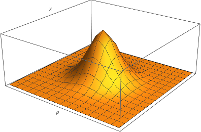



(28 May 2021) In this post I will derive the form for the Wigner quasiprobability distribution of a mixed quantum state in one dimension. It then of course straightforwardly extends to three dimensions. I will be mostly following [these notes](https://arxiv.org/abs/1502.00666).

Suppose we want a quasiprobability distribution $W(x, p)$ such that

$$\EX{}{f(\hat x, \hat p)} = \iint_{\bbR^2} W(x, p) f(x, p) dx  dp,$$

whenever $f(x,p)$ is a function symmetric in $x$ and $p$. When working with quantum systems, $\EX{}{f(\hat x, \hat p)} = \Tr\bargs{\hat \rho f(\hat x, \hat p)}$ for a density matrix $\hat \rho$, so we want that

$$ \Tr\bargs{\hat \rho f(\hat x, \hat p)} = \iint_{\bbR^2} W(x, p) f(x, p) dx  dp.$$

First we Fourier transform,

$$\widetilde W(\alpha, \beta) = \iint_{\bbR^2} W(x, p) e^{-i (\alpha x+ \beta p)}  dx  dp.$$

Notice that the right hand side is simply $\EX{}{e^{-i(\alpha x + \beta y)}}$. Thus, 

$$\widetilde W(\alpha, \beta) = \Tr\bargs{\hat \rho e^{-i \hat z}}$$

with $\hat z = \alpha \hat x + \beta \hat p$. It then only remains to calculate $\Tr\bargs{\hat \rho e^{-i \hat z}}$. Using the BCH formula with $[\hat x, \hat p] = i \hat 1$, we find that

$$\begin{aligned}
  \widetilde W(\alpha, \beta) &= \Tr\bargs{\hat \rho e^{-i \hat z}}\\
  &= \Tr\bargs{\hat \rho e^{-i\alpha \hat x}e^{-i\beta \hat p} e^{i \alpha \beta / 2}}\\
  &= e^{i \alpha \beta / 2} \int_\bbR \Tr\bargs{\hat \rho \ketbra{x}{x} e^{-i\alpha \hat x}e^{-i\beta \hat p}} dx\\
  &= e^{i \alpha \beta / 2} \int_\bbR e^{-i\alpha x}\Tr\bargs{\hat \rho \ketbra{x}{x} e^{-i\beta \hat p}} dx\\
  &= e^{i \alpha \beta / 2} \int_\bbR e^{-i\alpha x}\Tr\bargs{\hat \rho \ketbra{x}{x - \beta}} dx\\
  &= e^{i \alpha \beta / 2} \int_\bbR e^{-i\alpha x} \bra{x-\beta}\hat \rho \ket x,
\end{aligned}$$

where we used that $\hat p$ is the generator of translation. Now we inverse Fourier transform to find

$$\begin{aligned}
  W(x, p) &= \frac{1}{(2\pi)^2}\iint_{\bbR^2} \widetilde W(\alpha, \beta) e^{i (\alpha x + \beta p)} d\alpha  d\beta\\
  &= \frac{1}{(2\pi)^2}\iiint_{\bbR^3} e^{i \alpha \beta / 2}e^{-i\alpha y} \bra{y-\beta}\hat \rho \ket y e^{i (\alpha x + \beta p)} dy  d\alpha  d\beta\\
  &= \frac{1}{(2\pi)^2}\iiint_{\bbR^3} e^{i \alpha (\beta / 2 - y + x)} \bra{y-\beta}\hat \rho \ket y e^{i \beta p} dy  d\alpha  d\beta\\
  &= \frac{1}{(2\pi)^2}\iint_{\bbR^2} (2\pi)\delta(\beta / 2 - y + x) \bra{y-\beta}\hat \rho \ket y e^{i \beta p} d\beta  dy\\
  &= \frac{2}{(2\pi)^2}\iint_{\bbR^2} (2\pi)\delta(u - y + x) \bra{y-2u}\hat \rho \ket y e^{i 2u p} du  dy\\
  &= \frac{1}{\pi}\int_{\bbR} \bra{2x-y}\hat \rho \ket y e^{i 2(y-x) p} dy\\
  &= \frac{1}{\pi}\int_{\bbR} \bra{x-v}\hat \rho \ket{x+v} e^{i 2v p} dv
\end{aligned}$$

So we find that the Wigner quasiprobability distribution is

$$W(x, p) = \frac{1}{\pi}\int_{\bbR} \bra{x-v}\hat \rho \ket{x+v} e^{i 2v p} dv.$$

It is easy to verify that the marginal distributions are

$$\begin{aligned}
  \int_\bbR W(x, p)dp &= \bra x \hat\rho \ket x \\
  \int_\bbR W(x, p)dx &= \bra p \hat\rho \ket p.
\end{aligned}$$

#### Example: ground state of the harmonic oscillator

The ground state of the harmonic oscillator is

$$\psi(x) = \parentheses{\frac{m \omega}{\pi}}^{1/4} \exp(-m \omega x^2 / 2)$$

So

$$\begin{aligned}
    W(x, p) &= \frac{1}{\pi}\int_{\bbR} \braket{x-v}{\psi} \braket{\psi}{x+v} e^{i 2v p} dv \\
    &= \parentheses{\frac{m \omega}{\pi^3}}^{1/2} \int_{\bbR} \exp(-m \omega (x-v)^2 / 2) \exp(-m \omega (x+v)^2 / 2) e^{i 2v p} dv \\
    &= \parentheses{\frac{m \omega}{\pi^3}}^{1/2}e^{-m \omega x^2} \int_{\bbR} \exp(-m \omega v^2) e^{i 2v p} dv \\
    &= \text{Gaussian integral in } v\\
    &= \frac{1}{\pi} \exp(-\frac{p^2}{m \omega }-m \omega x^2).
\end{aligned}$$

In phase space, this looks like the following.


