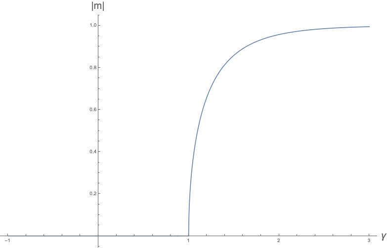



(13 Apr 2021) We will state and prove the Feynman/Bogoliubov inequality from which mean theory theory in statistical mechanics is derived. Then, we'll use it to show a simple example of its application to mean field theory.

### The Feynman/Bogoliubov inequality

*Note: this section comes from some old notes that I have. I unfortunately don't remember what references I was using.*

**Definitions:**
- $S$ denotes the set of configurations of the state space. For example, for a classical Ising model on $2$ spins, $S = \curlybrackets{\uparrow \uparrow, \uparrow\downarrow,\downarrow\uparrow,\downarrow\downarrow}.$
- $H\colon S \to \bbR$ is the Hamiltonian.
- $\expval X_H$ is the expected value of the observable $X\colon S \to \bbR$ under the Hamiltonian $H$, namely

  $$\expval X_H \coloneqq \frac{1}{Z}\sum_{s\in S} X\pargs{s} \exp\bargs{-\beta H\pargs{s}},$$

  where $\beta$ is inverse temperature as usual.
- $Z$ is the partition function

  $$Z \coloneqq \sum_{s \in S}\exp\bargs{-\beta H\pargs{s}}.$$

- $F$ is the free energy, defined as $$F \coloneqq -\frac{1}{\beta}\ln Z.$$
- Let $H'$ be any arbitrary Hamiltonian. $Z'$ and $F'$ are the same as before, but defined with respect to $H'$ instead of $H$.

**Theorem** *(Feynman/Bogoliubov inequality)*: For any $H'$, $F \leq F' + \expval{H-H'}\_{H'}$.

*Proof:* Let

$$\calH(\lambda) = H' + \lambda \parentheses{H-H'}$$

so that $\calH\pargs{0} = H'$ and $\calH\pargs{1} = H$. Similarly, let

$$\calF(\lambda) = -\frac{1}{\beta}\ln \sum_{s \in S} \exp\bargs{-\beta \calH(\lambda)(s)}$$

so that $\calF(0) = F'$ and $\calF(1) = F$. We will prove in the lemma below that $\calF$ is a concave function in $\lambda$. Therefore, it is always below any tangent line. Thus,

$$\calF(\lambda) \leq \calF(0) + \frac{d\calF}{d\lambda}\big\rvert_{\lambda=0} \lambda.$$

Plugging in $\lambda = 1$ gives $F \leq F' + \frac{d\cal F}{d\lambda}\big\rvert_{\lambda=0}.$ It remains to calculate

$$\begin{aligned}
\frac{d\calF}{d\lambda} &= -\frac{1}{\beta}\ln \sum_{s\in S}\exp\bargs{-\beta \calH(\lambda)(s)}\\
&= \frac{\sum_{s\in S} \frac{d\calH(\lambda)}{d\lambda}\exp\bargs{-\beta \calH(\lambda)(s)}}{\sum_{s\in S}\exp\bargs{-\beta \calH(\lambda)(s)}}\\
&= \frac{\sum_{s\in S} \parentheses{H(s) - H'(s)} \exp\bargs{-\beta \calH(\lambda)(s)}}{\sum_{s\in S}\exp\bargs{-\beta \calH(\lambda)(s)}}\\
&= \expval{H-H'}_{\calH(\lambda)}.
\end{aligned}$$

Thus, $\frac{d\calF}{d\lambda}\big\rvert_{\lambda=0} = \expval{H-H'}\_{H'}$, proving the theorem. 

**Corollary:** For any $H'$, $Z \geq Z' \exp\bargs{-\beta \expval{H-H'}\_{H'}}$.

To completely prove the theorem, it only remains to prove that $\calF$ is concave.

**Lemma:** $\calF(\lambda)$ (as defined in the proof of the theorem) is concave.

*Proof:* In the proof of the theorem, we had that $\frac{d\calF}{d\lambda} = \expval{H-H'}\_{\calH(\lambda)}$. Taking one more derivative yields (I omit the algebra)

$$\begin{aligned}
  \frac{d^2 \calF}{d\lambda^2} &= -\beta \parentheses{\expval{\parentheses{H-H'}^2}_{\calH(\lambda)} - \expval{H-H'}^2_{\calH(\lambda)}}\\
  &= -\beta \text{Var}_{\calH(\lambda)}\pargs{H-H'}.
\end{aligned}$$

Variance is of course always positive, since

$$\begin{aligned}
  \text{Var}(X) &= \expval{X^2}-\expval{X}^2\\
  &= \expval{\parentheses{X-\expval{X}}^2}.
\end{aligned}$$

Therefore, $\frac{d^2 \calF}{d\lambda^2}$ is always $\leq 0$, proving that $\calF$ is concave. 

### Application to mean field theory

Suppose we have some parameterized Hamiltonian $H_\theta'$, where $\theta$ is some parameter vector. This then defines a family of free energies $F_\theta'$. In mean field theory, we are generally interested in calculating some properties of a complicated interacting Hamiltonian $H$, but we consider mean field Hamiltonians $H'$ that are noninteracting. Thus, $H_\theta'$ should be a family of noninteracting Hamiltonians.

Define $F_{\theta}^{\text{MF}} = F_\theta' + \expval{H-H_\theta'}\_{H_\theta'}$. Notice that

$$\begin{aligned}
\expval{H'}_{H'} &= -\frac{\partial \ln Z'}{\partial\beta}\\
&= \frac{\partial\pargs{\beta F'}}{\partial\beta}\\
&= F' + \beta \frac{\partial F'}{\partial \beta}.
\end{aligned}$$

Thus,
\begin{equation}
  F_\theta^{\text{MF}} = \expval{H}\_{H'} - \beta \frac{\partial F_\theta'}{\partial \beta}.\label{eq:mf}
\end{equation}

The Feynman/Bogoliubov inequality tells us that $F_\theta^{\text{MF}} \geq F$. Thus, we look for a set of parameters $\theta^\ast$ that minimizes $F_\theta^{\text{MF}}$ in order to get the best approximation of $F$ as possible. As such, the mean field equation is summarized by $\delta F_\theta^{\text{MF}} = 0$, where the variation $\delta$ is with respect to the variational parameters $\theta$. In summary,

$$\theta^\ast = \argmin_{\theta} F_\theta^{\text{MF}}.$$

The point of all this is that $H_\theta'$ is chosen to be noninteracting, and thus simple. All the expectation values in \eqref{eq:mf} are taken with respect to the noninteracting Hamiltonian $H_\theta'$, and so are doable. Then we simply minimize over $\theta$ to get a noninterating approximation of $F$.

### Example: Ising model

Consider the Hamiltonian

$$H = -J \sum_{i< j = 1}^n s_i s_j,$$ 

where each $s_i \in \curlybrackets{1,-1}$. Let's define the noninteracting Hamiltonian $H_{h'}'$ to be

$$H_{h'}' = -h' \sum_{i=1}^n s_i$$

(here $h'$ is taking the role of $\theta$ from above). The partition function of $H_h'$ is simply $Z_h' = 2^n\cosh^n\pargs{\beta h'}$. Therefore,

$$F_{h'}' = -\frac{1}{\beta} \ln Z' = -\frac{n}{\beta} \ln 2\cosh\pargs{\beta h'}.$$

Since $H_{h'}'$ is noninteracting, we can calculate $\expval{H}\_{H_{h'}'}$ simply by calcuating the average magnetization per spin $m \coloneqq \expval{s_i}\_{H_{h'}'}$.

$$\begin{aligned}
m &= \frac{e^{\beta h'} - e^{-\beta h'}}{2\cosh\pargs{\beta h'}}\\
&= \tanh\pargs{\beta h'}.
\end{aligned}$$

Therefore,

$$\begin{aligned}
\expval{H}_{H_{h'}'} &= -J \sum_{i< j = 1}^n \expval{s_i}_{H_{h'}'} \expval{s_j}_{H_{h'}'}\\
&= -J \sum_{i< j = 1}^n \tanh^2\pargs{\beta h'}\\
&= -J \binom{n}{2} \tanh^2\pargs{\beta h'}.
\end{aligned}$$

Putting this together, we find

$$\begin{aligned}
  F_{h'}^{\text{MF}} &= \expval{H}_{H'} - \beta \frac{\partial F_\theta'}{\partial \beta}\\
  &= -J \binom{n}{2} \tanh^2\pargs{\beta h'} + \beta \frac{\partial}{\partial \beta}\parentheses{\frac{n}{\beta} \ln 2\cosh\pargs{\beta h'}}\\
  &= -J \binom{n}{2} \tanh^2\pargs{\beta h'} - \frac{n}{\beta} \ln 2 \cosh\pargs{\beta h'} + n h'\tanh\pargs{\beta h'}.
\end{aligned}$$

The mean field equation is then

$$\frac{\partial F_{\rm h'}^{\text{MF}}}{\partial h'} = 0.$$

Therefore,

$$0 = -J n(n-1)\frac{\tanh\pargs{\beta h'}}{\cosh^2\pargs{\beta h'}} + \frac{n h'}{\cosh^2 \beta h'}.$$

Finally, the best choice of $h'$ is the one that satisfies

$$J (n-1) \tanh\pargs{\beta h'} = h'.$$

Rephrasing this in terms of the average magnetization $m$, we see that the average magnetization predicted by mean field theory satisfies

$$m = \tanh\pargs{\beta J(n-1)m}.$$

Define the dimensionless quantity $\gamma \coloneqq \beta J (n-1)$. Then
\begin{equation}
  m = \tanh\pargs{\gamma m}.\label{eq:mag}
\end{equation}

#### Phase transition

We now look at solutions to \eqref{eq:mag}. Note that $\tanh$ is an odd function, and

$$\forall x\geq 0\colon~~ \tanh x \leq x, \quad \text{and} \quad \frac{d}{dx}\tanh\pargs{\alpha x}\big\rvert_{x=0} = \alpha.$$

From these facts, it is easy to see that $m=0$ is the only solution to \eqref{eq:mag} when $\gamma \leq 1$. However, when $\gamma > 1$, there are three solutions; namely, $m \in \curlybrackets{0, a, -a}$ for some $a\in (0,1)$ that we must find numerically. A simple calculation shows that a nonzero average magnetization gives a smaller free energy than an average magnetization of zero.

Therefore, the average magnetization predicted by mean field theory has a (second order) phase transition at $\gamma = 1$. The $\bbZ_2$ spin flip symmetry is spontaneously broken. By numerically solving \eqref{eq:mag}, we can generate the following plot of the average magnetization per spin as a function of $\gamma$.


